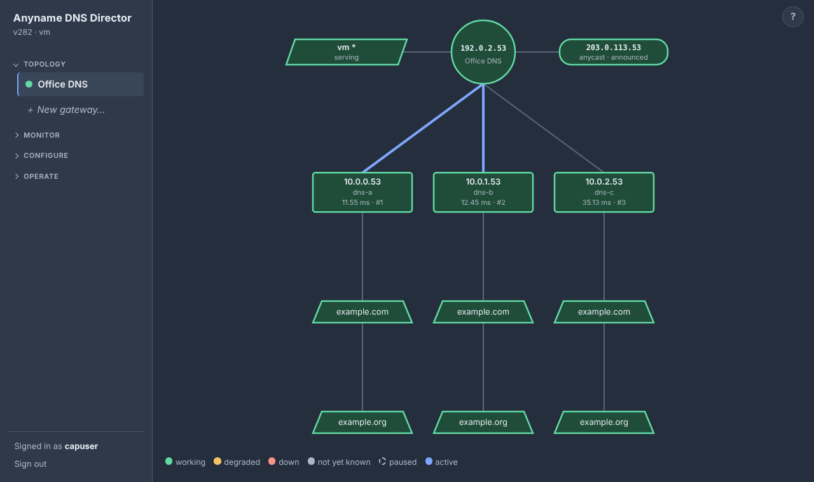
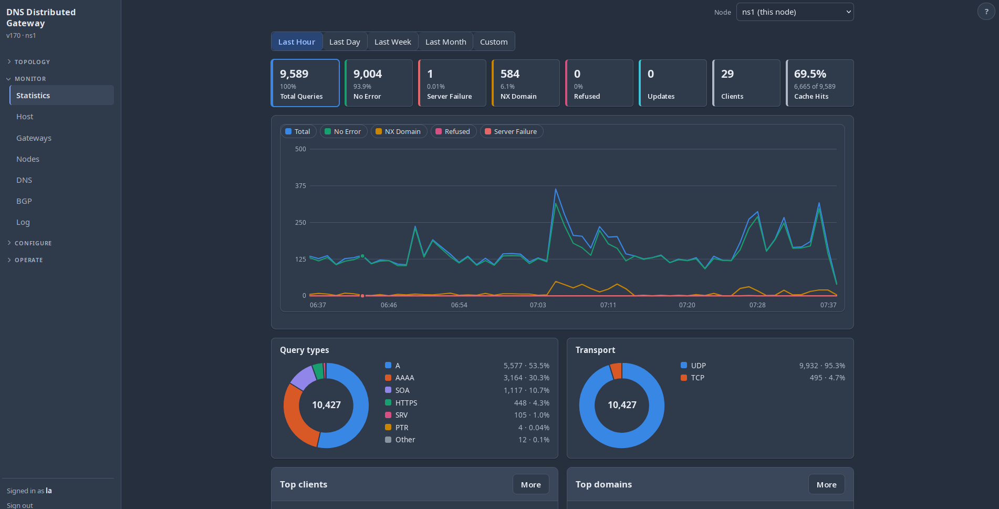

# ddgw — DNS Distributed Gateway

ddgw gives a group of machines one shared DNS address. Clients point at that
address (a **gateway**); every node answers it, and the nodes agree among
themselves, over a small multicast or unicast protocol, who owns which share of
the traffic, so a node can fail or restart without clients noticing.

Each node runs a caching DNS proxy that sends every query to the fastest healthy
upstream server, spreads load across servers of similar speed, fails over when
one goes down, and answers over UDP, TCP, DNS over TLS and DNS over HTTPS, with
per-client rate limiting. Gateways can also announce anycast addresses to your
routers over BGP (through FRR), withdrawing them when no upstream is healthy.

A web GUI (PAM login) and a command line manage the whole cluster: draw gateways,
servers and domains on a topology page, watch live statistics, and keep shared
settings, versions, certificates and software updates in step across nodes.





## How it works

A **gateway** is one shared address (its **VIP**, IPv4, IPv6 or both) served by
several nodes. The nodes of a gateway find each other over multicast (or, where
multicast is blocked, a unicast list of every node's address) and elect one
**controller (AGC)**; the others are **forwarders (AFN)**. The controller answers
ARP (IPv4) and neighbour solicitations (IPv6) for the VIP with the virtual MAC of
a node picked by the gateway's load-balancing method, so clients are spread over
all nodes. When a node stops or fails, another takes over its virtual MAC.
Gateways need Linux, macvlan support and root.

Every node answers DNS on the VIP through the same proxy: it probes the upstream
servers you give the gateway, forwards each query to the fastest healthy one and
keeps an answer cache. Extra **anycast** addresses on a gateway can be announced
to your routers over BGP.

Several nodes can be managed as one **cluster**: shared settings, config
history, certificates and software updates are kept in step from any node. The
cluster is for management only and is independent of the gateway election.

## Build from source

    # the Go module is in source/; docs/ has the changelog
    cd source
    go build -o ddgw .          # no third-party dependencies
    go test -race ./...
    ./ddgw --config ./ddgw.conf

## Install / upgrade / uninstall

New here? `QUICKSTART.md` at the top of the tarball walks through install, the first gateway and the web GUI.

```
tar xzf ddgw_vN.tgz && cd ddgw
sudo ./install.sh [--add-user NAME] [--no-start] [--no-keep-go] [--force] [-y] [--dry-run]
sudo ddgw-uninstall [--purge] [--remove-group] [-y]
```

Supported: Ubuntu, Debian, Fedora, RHEL, Rocky, Alma, Arch, Manjaro (and
derivatives that list one of them in `ID_LIKE`). The installer builds from the
source tree, installing only the prerequisites that are missing (gcc, PAM
headers, iproute2, FRR for the Anycast page, and a Go >= 1.24 toolchain — taken from the distribution's
own package (`golang-1.2x-go`/`golang-go`, `golang`, `go`) when that is recent
enough, otherwise downloaded from go.dev with a checksum check; a downloaded one is kept in `/usr/local/share/ddgw/go` because
the daemon rebuilds itself with it when you apply an update — `--no-keep-go`
removes it). FRR is installed with the distribution's `frr` package (EPEL on the RHEL family); if that fails the installer only warns, and ddgw leaves FRR untouched until a local AS is set on the Anycast page. It then installs
`/usr/local/sbin/ddgw`, the state directory `/var/lib/ddgw` (mode 0700), the `ddgw` group, `/etc/pam.d/ddgw`, a NetworkManager
drop-in that leaves the `ddgw*` macvlan interfaces alone, and the `ddgw`
systemd unit.

If ddgw is already installed the script upgrades it: the config, certificate,
group members and an existing PAM file are kept, the old binary is saved as
`/usr/local/share/ddgw/ddgw.prev`, and if the new version does not start the
old one is restored. The same version is a no-op (`--force` reinstalls; a
downgrade needs `--force`). The user who ran the installer (the one behind `sudo`) is added to the `ddgw` group
so they can log in to the GUI; `--add-user NAME` adds others. Uninstall keeps `/var/lib/ddgw` (the config, the
certificate, config history, cluster identity) unless `--purge` is given.

**Where things live**: everything ddgw keeps is in `/var/lib/ddgw` (mode 0700):
`ddgw.conf`, the GUI certificate, `versions/`, the cluster identity and update
data. The control socket is `/run/ddgw/ddgw.sock`.

**Fresh start / cloned VM**: if `ddgw.conf` does not exist the daemon creates it with
the defaults and **no gateways**, then starts; you draw the gateways under Topology.
To reset a node, stop the service, `rm -rf /var/lib/ddgw/*` and start it again (the
web certificate and the cluster identity are regenerated too; give a cloned machine
its own address first).

## DNS proxy

Every gateway serves DNS on its VIP; there is no switch for it. Give the gateway
its upstream servers (draw them on the Topology page, or use a top-level `dns`
block, see `source/ddgw.conf.example`). Every node that is AGC or AFN for that group
answers DNS on the VIP (UDP and TCP), so the VIP's load balancing spreads
clients across nodes, and each node forwards to the best upstream. A gateway
with no servers yet answers SERVFAIL and shows amber.

* **Eligibility** – every `dns.queries` entry is resolved against every server
  each `probe_interval_ms`. A query passes with NOERROR and at least one
  answer. A server gets traffic until `down_percent` (default 50) or more of its queries fail: with
  fewer failing it stays in use and shows amber (degraded), so one dead domain among three does not take
  a server out. `down_percent: 100` means down only when every query fails, `1` down on any failure. A
  server is dropped after `fail_threshold` consecutive failed rounds (probe or live) and re-admitted by the
  first passing round.
* **Latency** – an EWMA of response time, fed by probe round trips and by live
  forwarded queries. Eligible servers are tried fastest first; on timeout,
  SERVFAIL or REFUSED the next fastest is tried (up to `max_attempts`).
* **No eligible server** – clients get an immediate SERVFAIL, not a timeout.
* Truncated (TC) UDP answers are relayed so the client retries over TCP, which
  the proxy forwards over TCP.
* **Client subnet (ECS)** – on by default (`"ecs": true`; turn it off in Settings ▸ DNS proxy ▸
  Client network, or per gateway on the Topology page: edit the gateway → "Tell the DNS servers
  which network the client is on"). With it off, every upstream server sees all queries coming
  from the ddgw node. With it on the proxy attaches the
  client's *network* as an EDNS Client Subnet option (RFC 7871): the first
  `ecs_prefix4` bits (default 24) of an IPv4 client or `ecs_prefix6` (56) of an
  IPv6 client — never the full address. Servers that understand it (Google
  8.8.8.8, BIND, Unbound, PowerDNS …) can then log or answer per client network;
  others ignore it. Details: a client that already sent ECS is passed through
  untouched; a client without EDNS gets the option added and the OPT record
  removed from the answer again; a server that answers FORMERR or REFUSED is asked once
  more without it (and, if that works, not sent ECS any more); loopback and link-local clients are never sent; probes carry
  no client. `--show-dns` and the DNS page show whether it is on and how many
  queries carried it. Set it per gateway (inside the group's `dns` block) or in
  the shared top-level block. ECS is not DoT/DoH.
* **DNS over HTTPS to clients** – set `doh_port` (usually 443; 0, the default, is off) and the gateway address (and any anycast address of the gateway) also answers DoH (RFC 8484) at `https://<address>:<port>/dns-query`: POST with an `application/dns-message` body, or GET with the message as the base64url `dns` parameter; HTTP/2 or HTTP/1.1, TLS 1.2 or later, the GUI's certificate, the same pool, cache and statistics as plain DNS (counted as TCP). Only that path is served (others get 404; a wrong method 405, content type 415, a bad message 400). `doh_port` must differ from `listen_port` and `dot_port`; if it cannot be opened the error is logged and the other listeners keep running. There is no `Cache-Control` freshness on answers (`no-store`) and no client-certificate or token check: it is as open as plain DNS on the same address.
* **Client Rate Limiting** – in the top-level `dns` block (Settings ▸ DNS proxy ▸ Client Rate Limiting); every gateway uses it, including one with its own `dns` block, whose copy of these values is ignored: `allowed_clients` is a list of networks (`10.0.0.0/8`, `192.168.1.5`, `2001:db8::/32`) that may use the proxy — empty (default) is everyone; any other client is answered REFUSED, dynamic updates included. `client_rate` is the queries per second one client (an IPv4 address, or an IPv6 /64) may send (0, the default, is no limit) and `client_burst` how many at once (0 = twice the rate, at least 10); `client_action` is what a client over its rate gets: `drop` (default: nothing is sent, so a forged source cannot be used to bounce answers at a victim), `truncate` (UDP: a short answer with the TC bit, so a real resolver retries over TCP) or `refused`. Over TCP, DoT and DoH the address is real and the answer is always REFUSED. `client_exempt` lists networks never rate limited (they stay subject to `allowed_clients`). The node itself (loopback) is always allowed and never limited. Both checks run before the cache; the DNS page and `--show-dns` show the limit and how many queries were refused or turned away, and the log says so at most once a minute. Counters are per node (a client that reaches several nodes gets the limit at each), and at most about 130,000 clients are tracked at once (a flood of new addresses cannot grow memory further; a forgotten client simply starts with a full burst). This is per-client *query* limiting, the kind resolvers use, not response rate limiting (RRL), which protects authoritative servers.
* **Fallback servers** – `fallback_servers` in the `dns` block (shared, or a gateway's own; Settings ▸ DNS proxy ▸ Fallback servers, *Edit gateway…* on the Topology page, or `--canvas-add fallback --group N --server ADDR` / `--canvas-del fallback …`) lists upstreams that are used **only while no normal server is in service** (every one down or paused, or none listed; only a paused or stopped gateway serves nothing at all). They are **never probed** and always count as up (the domains the normal servers are tested with may be internal names a public resolver knows nothing about, so probing a fallback with them would only mislead); while no normal server is in service only the fallbacks take queries, and as soon as a normal server passes a probe again the pool goes back to the normal servers and the fallbacks get nothing. The DNS page marks them and says when they are in use, the canvas shows amber "answering from the fallback servers", the log says when the pool switches either way. They may use `tls://`/`https://` like any server; a fallback cannot also be a normal server, and `server_queries`, names and pausing apply to normal servers only.
* **DNS over TLS to clients** – set `dot_port` (usually 853; 0, the default, is off) in the `dns` block (shared, or a gateway's own) or under Settings ▸ DNS proxy, and the VIP (and any anycast address) also answers DoT (RFC 7858) on that TCP port, through the same pool, cache and statistics as plain DNS. The certificate is the web GUI's: whatever Settings ▸ Web GUI shows (the self-signed one until you install a real one), so clients that check certificates need a certificate valid for the name or address they connect to. `dot_port` must differ from `listen_port`; if the DoT port cannot be opened the error is logged and plain DNS keeps running. DoT queries count as TCP in the statistics. `tls_insecure` is about the other direction (servers you forward to): a DoT listener has no client certificate to skip.
* **DNS over HTTPS to a server** – list a server as `https://host`, `https://host:port` or `https://host/path` (port 443 and path `/dns-query` unless given) and each query is sent to it as an HTTPS POST of the DNS message (`application/dns-message`, RFC 8484; HTTP/2 when the server offers it, no redirects followed, never through a proxy). The certificate rules and `tls_insecure` are the same as for `tls://`. As with DoT every probe and query opens a new connection, so a DoH server's measured latency includes the TLS handshake and HTTP request. Clients can also use DoH to reach ddgw (`doh_port`).
* **DNS over TLS to a server** – list a server as `tls://host` or `tls://host:port` (port 853 by default; the host is an IP address or a name) and ddgw probes it and forwards to it over TLS (RFC 7858), whatever the client used to ask. The server's certificate must be valid for that host name (or IP address) and signed by an authority this machine trusts; a certificate that is not is refused and the server shows as down with the reason. **`tls_insecure`** (Settings ▸ DNS proxy, shared block or a gateway's own `dns` block; off by default) accepts any certificate from a `tls://` or `https://` server — self-signed, expired, the wrong name — for when you cannot fix the server: the traffic is still encrypted but the server is not authenticated, so anyone on the path could answer as it. While it is on the DNS page shows "tls:// certificates not checked", `--show-dns` says so and the log warns when the pool starts. A plain and a TLS entry for the same host are two servers. Clients reach ddgw over plain DNS, DoT (`dot_port`) or DoH (`doh_port`).
* **Spread** – the healthy servers whose smoothed latency is within `spread_band` percent (default 20, 1–1000) of
  the fastest one's take turns, round-robin, so a pool of equally good servers shares its load; slower servers stay
  fallbacks behind them. On by default; `"spread": false` (Configure → Settings → DNS proxy) gives every query to the fastest server and
  keeps the rest as fallbacks. **Where it is set:** the load-balancing settings (spread, spread band, down at, failures before down,
  max servers tried, latency smoothing) are the Settings values for every gateway, including one drawn on the Topology page with
  its own servers. A gateway can have its own instead: Topology ▸ right-click the gateway ▸ *Edit gateway…* ▸ **Load balancing** ▸
  *own values* (`"lb": {…}` in the gateway's `dns` block, or `--canvas-set gateway --group N --spread-band 200`; `--lb settings`
  goes back). A failing or SERVFAIL/REFUSED
  answering server hands the query to the next in the order either way. The band is relative, so 0.2 ms against 0.3 ms
  is not "within 20%". `--show-dns` and the DNS page show whether it is on; the Served column shows the real split. On the Topology page the line from a gateway to each server that is currently within the band is drawn **blue** (`--canvas` marks them `[spread: takes turns]`).
* **Answer cache** – a pool answers a repeated query from memory for as long as the records' TTLs allow
  (on by default; `"cache": false` or Configure → Settings → DNS proxy switches it off, for every gateway, including one with its own `dns` block). It keeps NOERROR answers
  (also "no data") and NXDOMAIN, and a negative answer only with the zone's SOA, whose MINIMUM says how long it
  holds (RFC 2308). An entry lives for the smallest TTL among its records and at most `cache_max_ttl` seconds
  (default 3600); the TTLs a client sees count down with the entry's age and are capped to that maximum. At most
  `cache_entries` answers (default 10000) are kept, the least recently used leave first. The key is name, type and
  class, the RD/AD/CD flags, EDNS and its DO bit, the UDP size the client allows, the transport and — with ECS on —
  the client's network (a /24 or /56), so every network gets the answer the upstream gave it; the ID and the
  spelling of the name (0x20 randomisation) come from each client's query. A client cookie does not change the key
  and is dropped from the stored answer. Never cached: SERVFAIL, REFUSED, truncated answers, zone transfers,
  TSIG-signed queries, queries with EDNS options other than a cookie (ECS from the client, NSID, ...), updates.
  ANY queries are cached like any other type.
  The cache belongs to the pool, so adding, pausing or removing a server (which makes a new pool) empties it.
  A hit counts as a handled query in Statistics and on the DNS page, which also shows hits, misses and entries
  (`ddgw --show-dns`: the `answer cache:` line). It does not serve stale answers: with every upstream down a name
  whose TTL ran out gets SERVFAIL.
* **Dynamic DNS updates (RFC 2136)** – an UPDATE message sent to the VIP (`nsupdate`, a DHCP
  server, Windows and Linux clients registering themselves …) cannot be handled by the upstream
  resolvers. The proxy asks for the SOA record of the zone named in the message, takes the primary
  server from it (`MNAME`; if that name does not resolve, the zone's NS records), and forwards the
  message there on port 53, **unchanged** — so its ID and any TSIG/SIG(0) signature stay valid — then
  hands the primary's answer back to the client. Over TCP the update goes over TCP; a truncated UDP
  answer is retried over TCP. The primary is cached for the SOA TTL (30 s to 5 min) and looked up
  again once if the cached one fails. No SOA for the zone: NOTAUTH; the primary cannot be reached:
  SERVFAIL; a malformed message: FORMERR; a zone class other than IN: NOTIMP. An update is never
  forwarded to the VIP itself. Every update is logged (INFO when the primary accepted, WARN
  otherwise) and counted in Statistics as the type **UPDATE** under the zone name, with its own **Updates** tile (count and how many failed) and chart line; they are counted in the total
  but not again under No Error or Refused. Click the **Updates** tile to see only updates (chart, who sent them, which zones) and the last 200
  updates under **Recent dynamic updates** (and by `ddgw --dns-updates`): time, client, zone, what
  it changed (`add host1.example.com A 192.0.2.7`, `delete old.example.com A`), the primary and its answer. A primary that
  filters by source address sees the ddgw node, not the client — use TSIG keys, which travel with the
  message. Switch it off with `"forward_updates": false` (Configure → Settings → DNS proxy): updates
  are then answered REFUSED. Note that anyone who can reach the VIP can send updates to your primary
  this way; the primary's own authorisation (TSIG, ACL) is what decides.
* `ddgw --show-dns` prints the ranking, health, latency and counters.
* Probe domains can be set per server (`server_queries`) and a gateway can have
  its own pool — see [Topology](#topology).
* The whole `dns` block hot-reloads; a changed pool is probed before it replaces
  the old one.

## Topology

The first page of the GUI is a drawing of your configuration. Each **gateway is an
item under Topology** in the sidebar (with *＋ New gateway…* at the end): a **circle** (the shared gateway address, its VIP), a **square** under
it for every DNS server it forwards to, and a **trapezoid** under each square for
every domain that server has to answer.

* The circle shows just the address (no prefix length) and sizes itself to fit
  even a full IPv6 address; a dual-stack gateway shows IPv4 and IPv6 together.

* Hover the circle to see which cluster nodes are serving the gateway right now
  (which is this node, which is the gateway controller, each node's slot).

* **Cluster nodes** (only with two or more nodes): each node of the cluster is a **parallelogram** to the left of the
  circle, this node first (marked with a star), named by host name (by address when two nodes share a name), with how it stands for this gateway:
  green *serving*, amber *not serving* (up, but not serving the gateway yet), amber *degraded* (serving, but its own view of the gateway is degraded, e.g. some of its DNS servers are down), dashed *paused* (the node is paused on the Power page, or
  the gateway is paused or absent there), red dashed *not answering*. A node whose **CPU, memory or fullest disk is over 85%** (the Monitor ▸ Host numbers: the last 10-second CPU sample, memory in use, the fullest of the tracked filesystems) is **solid yellow** (degraded) — whatever else it is doing, even paused — and names what is over ("CPU 91% · disk 88%"; the tooltip names the mount) until every one is back at 85% or below. The log records it too: a warning when a node goes over (naming CPU, memory and/or disk) and an info line when it is back at or under, for this node and every reachable member, checked each sync interval; a reading that only moves while still over is not logged again. Hover one for its address, role, last-seen time, version, whether it has caught up
  with the primary's settings and any update under way. Right-click any reachable node ▸ *Pause node…* / *Resume node* (another node is paused through the cluster, like the Node page does
  with the Node menu; its shape reads "pausing…" until it reports back), *Host statistics…*, and for another node *Open this node* (the Node menu, top right); an unreachable one ▸ *Cluster page…*. They are read-only here: add or remove nodes on the Cluster page.
  `ddgw --canvas` lists them as `/_/ cluster node` lines.

* **Four rows per side, or three.** The anycast addresses (right of the circle) and the cluster nodes (left) stand four to a column; the fifth starts a new
  column further out, and so on. When a four-row side would have a line to a server run through a box, both sides use three rows instead. Anycast addresses can be dragged to any slot, in any column. The drawing grows wider as columns are added (pan with the mouse).

* Every tooltip ends with the item's **uptime**: how long the gateway, anycast address, server or
  domain has been online since it last came back, or how long it has been down, and how many failures
  it has had: "Online for 1m 1s - 0 failures". Green and yellow count as online; paused and grey items
  show nothing. A sampler in the daemon notes the changes every 2 s (no browser needed), in memory only,
  so the counting (failures too) restarts with ddgw. `ddgw --canvas` prints the same in brackets.

* **Pause / resume** (right-click a gateway, server, domain or anycast address ▸ *Pause ▸ This node | All nodes*):
  *This node* is kept in this node's own settings (never replicated); *All nodes* is shared. A paused gateway
  releases its address and stops answering; a paused server gets no queries or probes; a paused domain is not
  asked (the last active domain of a server cannot be paused); a paused anycast address is not announced.
  The two scopes are independent. Paused items are grey and dashed. CLI:
  `--canvas-pause|--canvas-resume gateway|server|domain|anycast --group 1 [--server ADDR] [--name DOMAIN]
  [--address ADDR] --scope node|all` (`--scope` defaults to node for a gateway, all for a server, and is
  required for a domain or an anycast address).
  To take the **whole node** out at once (every gateway on it, including ones added later), use
  Operate ▸ Node ▸ *Maintenance* (or `--node-pause`); see Node below.
  **Resuming** (and starting the daemon, or adding a gateway) does not put the node
  back in service at once: it first probes its DNS servers and only joins the
  gateway when they all answer — or, after 10 s, when at least one does (after 60 s
  it starts regardless). Meanwhile the other nodes keep serving and the circle
  shows "starting — waiting for the DNS servers to answer".

* **Right-click** anything: the circle (Edit gateway…, Add DNS server…, Delete
  gateway), a square (Statistics…, Edit server…, Add domain…, Delete server), a trapezoid
  (Edit domain…, Add domain…, Delete domain), or the empty drawing (New gateway…, Add DNS server…). Add and Edit open
  a popup form; deleting something with things under it asks first and says how
  many. Left-click selects a shape; the Delete key deletes it. There is no button row —
  the right-click menu is the one place for these actions.
* **Statistics** (right-click a square, a trapezoid or the circle ▸ *Statistics…*; CLI `ddgw --server-stats ADDR [--stats-range 1h|1d|7d]`,
  `ddgw --server-stats ADDR --name DOMAIN [--type T]`, `ddgw --gateway-stats GROUP`): graphs for the last hour, day or week (a server's and a domain's are the picked node's
  own view; a gateway's adds up every reachable node of the cluster, since which node answers a client is up to the clients; per minute for the hour, per 5 minutes for a day, per 30 minutes for a week). A **server** (square) shows **latency** (average and
  worst of the answers) and **loss** (the share of attempts, live queries and probes together, that failed: no answer in time, or
  SERVFAIL/REFUSED). A **domain** (trapezoid) shows the latency and the failed share of the health probes of that domain on that server (probes
  only, about 12 a minute, so the failure curve is coarser). The **gateway** (circle) shows what clients get: **answer time** (one answer in
  eight is timed; cache hits included), **errors** (SERVFAIL/REFUSED answers, not clients turned away by the client list or rate limit),
  **availability** (the share of the 2-second checks, the same ones that drive the circle's uptime, that found the gateway working; paused
  or not-yet-started time is not counted) and **queries per second**, with the part answered from the cache. A gap means nothing happened
  in that time (paused, or the node was down, or — for a server or domain — nothing was asked of it). A gateway's graphs sum the nodes that answer the
  cluster call (the dialog says "All 3 nodes counted together", or how many were counted and how many did not answer; a single node shows just this node). The history is kept per node for 7 days, one slot per minute, and saved with the other
  statistics (`stats.json.gz`, every 5 minutes and when ddgw stops), so a restart keeps it (time ddgw was down is a gap). A server address
  listed by two gateways is one series; a gateway's series covers all its addresses (IPv4, IPv6, anycast) on this node.
* **Zoom, pan and arrange the drawing.** Dragging the empty background moves around the drawing in any direction. The mouse wheel over the drawing zooms it (20% to 300%, around the pointer; the zoom is kept across
  the refreshes and reset when you pick another gateway); a double-click on the empty drawing fits it to the window again. **Drag** a server
  left or right (it takes its domains along), a domain up or down, or an anycast address up or down to put it in another place: a dashed
  outline shows where it will land, letting go saves the new order, Escape puts it back, and a click without moving still just selects.
  The order is only how things are drawn and probed (servers are still chosen by speed). CLI: `ddgw --canvas-move server|domain|anycast … --to N`.
* **Add DNS server** looks things up for you: fill in the IP address and the **Name** is filled in from its reverse (PTR) record; fill
  in a host name as the Name and the address is looked up (IPv4 preferred). The lookup is made by the node being configured, once, when you leave
  the field, and only fills a field that is empty or still holds an earlier lookup — a name or address you typed yourself is never overwritten, and
  you can change a looked-up name to anything (it is saved as typed). CLI: `ddgw --dns-lookup IP|NAME`. A domain name too long for its trapezoid is
  cut with “…” so it stays well inside the shape, and so is a long server address or name inside its box (hover for the full text).
* Deleting a **trapezoid** removes just that test; deleting a **square** removes
  the server and all its domains; deleting a **circle** removes the gateway and
  everything under it (you are asked first, with counts). Deleting the last
  circle leaves a configuration with no gateways — `"groups": []`.
* Every change is **saved as soon as you make it** — there is no Apply button. To
  keep every saved state valid, a new gateway starts without a DNS proxy (it gets
  one with its first server), adding a server asks for its first domain, the last
  domain of a server cannot be deleted (delete the server instead) and deleting
  the last server leaves a bare gateway. If the daemon refuses a change, the
  drawing goes back to what is saved and the reason is shown. Every change is a
  config version (History).
* Colours come from the running daemon: **green** working, **yellow** degraded
  (the gateway runs but a server is down; a server is up but one of its tests
  fails), **red** down (no healthy server; a server that fails its tests),
  **grey** not known yet (not applied, not probed yet).
* A domain is a **health test**, not a route: ddgw sends every client query to
  the fastest healthy server; a server counts as healthy while fewer than
  `down_percent` (50 %) of *its* domains fail.
* Each gateway has its **own pool**; two gateways may use different servers.
  A server can be an IP (`8.8.8.8`, `8.8.8.8:5353`, `[2001:db8::53]`) or a host
  name (resolved each time it is probed).
* In a cluster the whole drawing (address, servers, domains) is shared and edited
  anywhere; the network interface stays per node.
* Two gateways cannot use the same address.
* **IPv4 and IPv6**: a gateway may have both addresses (one engine per family).
  The circle then shows both, with a small green/yellow/red chip for each
  family, and the gateway's own colour is the worst of the two (an IPv6 engine
  that is not serving is yellow even if IPv4 is fine). DNS servers can be IPv4,
  IPv6 (`2001:db8::53`, `[2001:db8::53]:5353`) or names.

CLI equivalent — same drawing, same colours:

    ddgw --canvas                                  # tree with status
    ddgw --canvas-add gateway --vip 10.0.0.53/24 --interface eth0 \
         --server 8.8.8.8 --name google.com        # circle + first square + first trapezoid
    ddgw --canvas-add domain --group 1 --server 8.8.8.8 --name microsoft.com
    ddgw --canvas-add server --group 1 --server 8.8.4.4 --name apple.com
    ddgw --canvas-del domain --group 1 --server 8.8.4.4 --name apple.com
    ddgw --canvas-add fallback --group 1 --server 1.1.1.1   # used only while every server is down
    ddgw --canvas-set gateway --group 1 --vip6 2001:db8::53/64 --ecs on   # add IPv6, turn on ECS
    ddgw --canvas-set gateway --group 1 --label "Office DNS"   # a name instead of the address (--label - clears)
    ddgw --canvas-set gateway --group 1 --spread-band 200      # this gateway's own load balancing (also --spread on|off, --down-percent,
                                                               #   --fail-threshold, --max-attempts, --latency-alpha); --lb settings goes back
    ddgw --canvas-set server --group 1 --server 10.0.0.53 --label dns-a   # a server's name (also on --canvas-add server; - clears)
    ddgw --canvas-add anycast --group 1 --address 203.0.113.53   # an anycast address (--canvas-del anycast removes one)
    ddgw --canvas-set gateway --group 1 --anycast A,B             # or replace the whole list (--anycast - clears)
    ddgw --canvas-del gateway --group 1 --yes

(each CLI step is saved at once, so a new server is added together with its first
domain). In the file it is a `dns` block inside the group:

    "dns": { "servers": ["8.8.8.8", "8.8.4.4"],
             "server_queries": { "8.8.8.8": ["google.com", "microsoft.com"],
                                 "8.8.4.4": ["apple.com", "amazon.com"] } }

Groups without their own `dns` block use the top-level one, and `server_queries` entries override the global `queries` for that server.

## Anycast addresses (BGP)

A gateway can carry extra addresses of **any subnet** next to its shared address
(`extra_vips`; GUI: right-click the gateway circle → *Add anycast address…*, each
address is a pill beside the circle with its own menu; CLI:
`--canvas-add anycast --group 1 --address 203.0.113.53`, `--canvas-del anycast …`, or
`--canvas-set gateway --group 1 --anycast A,B` to replace the whole list). They are
not checked against the interface and do not take part in the election: **every**
node running the gateway puts them on `lo` and answers DNS on them (same
servers, domains and failover as the shared address, on `listen_port`). They are
shared across the cluster and need DNS servers on the gateway.

An address is held only while this node can answer on it — gateway running, not
paused, listener up, at least one DNS server healthy. Otherwise it is taken off
`lo`, so the route disappears from your routing daemon. It is added with a
10-second lifetime that ddgw renews every 3 s, so if ddgw crashes or hangs the
kernel removes the address by itself within about 10 s instead of leaving a route
that nothing answers. The drawing and `--canvas` show whether each address is
announced from the node you are looking at. When the node manages BGP, the pill is green when every neighbor of its family has an established session (IPv4 address → IPv4 neighbors, IPv6 → IPv6), amber when some do and some do not, and red when none does, when it has no neighbor of that family, or when BGP is disabled on the node (Operate → Anycast). A neighbor that is disabled or still connecting counts as not established.

## BGP (FRR)

ddgw can drive FRR on a node so the anycast addresses are announced without any
hand-written routing config (GUI: **Configure → Anycast**; CLI below). It is **per
node** — the AS, router id and neighbors are never replicated, because a node
usually peers with its own upstream router; only the anycast addresses are shared.

BGP runs on a node while a local AS number is set. That makes ddgw the owner of the
node's `/etc/frr/frr.conf`: it renders the whole file (BGP only), sets `bgpd=yes`
and `bfdd=yes` in `/etc/frr/daemons`, and reloads FRR (`systemctl reload frr`, a
restart when a daemon is switched on or off). FRR must be installed, with its `frr-pythontools`
package (the installer adds both) — without it a reload cannot work, so ddgw restarts FRR for every
change and the sessions drop briefly. An `frr.conf` that ddgw did not write is saved once as
`frr.conf.pre-ddgw` before it is replaced. Clearing the
AS number removes the BGP section and leaves FRR running (the router ID can only be set while an AS is set, and clearing the AS clears it); **Operate → Anycast** does the same without forgetting any setting (*Disable BGP*), and can shut down a single neighbor (`neighbor … shutdown`, the neighbor stays configured); a node that never set an
AS never has its FRR files touched. BFD is on for every neighbor. BGP keepalive and hold time are settings next to the router ID (default 3 s / 9 s; `--keepalive S --hold S`, `-` for the default); the session uses the lower hold time of the two ends. A neighbor can have a **multihop** limit (2-255, eBGP only) for a peer that is not on a connected subnet; FRR then runs BFD to it in multihop mode, so the peer must be set up the same way. Do not run this on a
host whose FRR is managed by something else — they would overwrite each other.

    ddgw --bgp                                                    # settings, neighbor and BFD state, announced addresses
    ddgw --asn 64512 --router-id 192.0.2.10        # --router-id needs an AS, set now or earlier
    ddgw --keepalive 3 --hold 9
    ddgw --bgp-neighbor-add 192.0.2.1 --remote-as 64500 --description core
    ddgw --bgp-neighbor-add 2001:db8::1 --remote-as 64500
    ddgw --bgp-neighbor-add 10.0.1.5 --remote-as 64512 --multihop 2   # peer not on a connected subnet (e.g. AWS VPC Route Server)
    ddgw --bgp-neighbor-del 192.0.2.1
    ddgw --asn off                                 # also clears the router id
    ddgw --bgp-disable                             # stop BGP on this node, settings kept (--bgp-enable)
    ddgw --bgp-neighbor-disable 192.0.2.1          # shut one neighbor down, kept (--bgp-neighbor-enable)

What the node does, and no more:

- **Announce only its anycast addresses.** Each is a `network` statement, and an
  outbound route-map permits only those prefixes (`/32` and `/128`).
- **Accept nothing.** An inbound route-map denies every route, so a peer cannot
  change the host's routing table.
- **An IPv4 address goes to the IPv4 neighbors, an IPv6 address to the IPv6 ones**;
  add a neighbor of each family to announce both.
- A prefix is in FRR's table only while ddgw holds the address on `lo`, so it is
  withdrawn when no DNS server answers, the gateway is paused or ddgw stops, and
  within about 10 s if ddgw is killed (the address lifetime, see above). BFD is on
  for every neighbor; lower the router's timers to shorten the time your peers need
  to notice.
- The neighbor password is an MD5 TCP session password; it is stored in the config
  file and its history (root-only), and `--password` on the command line is visible
  to other users of the host — the Anycast page is the safer place to set it.
- **Monitor → Anycast** shows each neighbor's session and BFD state, read from FRR
  (`vtysh -c "show bgp summary json"`, `show bfd peers json`) every few seconds, and
  which anycast addresses are announced. **Configure → Anycast** (card *BGP*) has the AS, router ID
  and the neighbor table (**+** adds a row, **−** removes the highlighted one).

The generated config looks like this:

    ip prefix-list DDGW-ANYCAST-V4 seq 10 permit 203.0.113.53/32
    route-map DDGW-OUT-V4 permit 10
     match ip address prefix-list DDGW-ANYCAST-V4
    route-map DDGW-IN deny 10
    router bgp 64512
     no bgp default ipv4-unicast
     neighbor 192.0.2.1 remote-as 64500
     address-family ipv4 unicast
      network 203.0.113.53/32
      neighbor 192.0.2.1 activate
      neighbor 192.0.2.1 route-map DDGW-IN in
      neighbor 192.0.2.1 route-map DDGW-OUT-V4 out
     exit-address-family

### Cloud use (untested)

Clouds block multicast and ignore virtual MACs, so the gateway VIP cannot be reached there. The
anycast addresses can: they are plain `/32` routes announced over BGP. Possible setup, **not tried
in any cloud**:

- Give a gateway a VIP that is an **unused address in the node's own subnet** (a gateway only starts
  when the node has an address in the VIP's subnet), and list **every node's address** under
  *Neighbors (unicast mode)* so the nodes find each other without multicast. The list is shared, so
  you fill it in once. The VIP forms but nobody uses it.
- Add the anycast addresses to that gateway and announce them with BGP (Configure ▸ Anycast). For a
  peer that is not on a connected subnet, such as an AWS VPC Route Server endpoint, set the
  neighbor's **Multihop** (usually 2); the peer must use multihop BFD as well.
- The gateway joins the election only after its DNS servers answer, and an anycast address is
  announced only while a server answers.
- In AWS, also turn off source/dest check on the instances and allow BGP (TCP 179) and BFD
  (UDP 3784, 4784) in the security groups.

## AFN nodes and the VIP

The AGC owns the VIP on its macvlan. An AFN is reached through its vMAC, but the
kernel only accepts traffic for addresses it owns, so an AFN
adds the VIP to `lo` as /32 (/128) and sets `arp_ignore=1` / `arp_announce=2`
on the parent interface and its macvlan so it never answers or advertises ARP
for the VIP. The AGC stays the only ARP/NS authority.

**Who is controller.** The node that is controller stays controller. A node that
joins or restarts becomes a forwarder even when its priority is higher or its
address sorts higher; it takes the role only if it has **preemption** enabled (the
Settings switch) and outranks the controller, or if two controllers meet and one
must give way. So after a node was restarted the roles stay as they fell, instead
of moving twice. The controller marks its hellos with a flag (bit 3) — a node that
took over keeps its old slot number, so slot 1 alone no longer tells a joiner who
the controller is; a leaving node sets bit 2.

**Slots and virtual MACs.** A slot is one MAC (`00:1a:7c:<group>:<slot>:00`) on the
wire, whichever address family uses it, so a node takes the same slot in IPv4 and IPv6
when it can and never one that a node it hears (in either family) already has. A
controller that gives way to a better one moves to a free forwarder slot; two
forwarders that picked the same slot settle it by rank (the lower one moves). The
IPv4 and IPv6 sides of a node share the interface of a slot, which is removed only
when neither uses it any more. The two families elect their controllers separately and
may pick different nodes; the IPv6 controller then moves off slot 1 to a free slot, so
no MAC is ever on two nodes.

### Real-MAC mode (no virtual MACs)

Virtual MACs need the network to deliver frames addressed to a MAC that is not the NIC's own. A VMware port group with
promiscuous mode off drops them, and clouds that allow one MAC per interface do the same. For those, a gateway has a setting,
**Use real MAC addresses** (Settings, a gateway's card; `real_macs` in the file, `--configure`; off by default, shared by
the cluster, and changing it restarts the gateway), and everything above is replaced as follows.

- There is no macvlan and no slot MAC. Every node, the controller too, holds the VIP on `lo` and has `arp_ignore=1` /
  `arp_announce=2` set on the real interface (put back when the gateway stops).
- The controller still answers ARP and IPv6 neighbor solicitations for the VIP and still picks a node by the load-balancing
  method, but the answer names the **real MAC** of the node it picked (its own MAC for its own slot, and for any node whose
  MAC it does not know yet: it holds the VIP too, so that is always right). It is sent from the controller's own MAC.
- The controller learns the real MACs without any change to the gateway protocol: from an ARP a node sends, from any IPv6
  frame from a node's link-local address, and by asking (an ARP request or a neighbor solicitation of its own) for the ones it
  has not heard, again every minute. Nodes of any version take part.
- A real MAC cannot be taken over. When a node dies or leaves, the controller announces the VIP at its own MAC with an
  unsolicited ARP (or neighbor advertisement), now and twice more within a second. Neighbors that honor one repoint at once;
  the others keep sending to the dead node until their ARP entry ages out (a Palo Alto's default is 30 minutes), so check
  how your firewalls treat it before relying on this mode. A planned stop gives the announcement a head start (the leaving
  node stays up for a moment after the controller has been told).
- The vMAC column of Monitor ▸ Gateways shows real MAC addresses (the controller knows all of them, a forwarder only its own).

## Web GUI

Everything the CLI does is also in a browser, over HTTPS on port **53853**
(`web.listen`). The page follows the system light/dark theme automatically.

| CLI | Web GUI |
| --- | --- |
| `--canvas`, `--canvas-add`, `--canvas-del` | Topology page (draw gateways, servers, domains; live colours) |
| `--server-stats ADDR` `[--stats-range 1h\|1d\|7d]` | Topology page: right-click a server ▸ **Statistics…** (latency and loss graphs) |
| `--canvas-move server\|domain\|anycast` `--group N` `--server ADDR` `[--name DOMAIN \| --address ADDR]` `--to N` | Topology page: drag a server left/right, a domain or an anycast address up/down |
| `--dns-lookup IP\|NAME` | Add DNS server form: the Name is filled in from the address (reverse DNS), or the address from a name |
| `--server-stats ADDR --name DOMAIN` `[--type T]` | Topology page: right-click a domain ▸ **Statistics…** |
| `--gateway-stats GROUP` `[--stats-range 1h\|1d\|7d]` | Topology page: right-click the gateway circle ▸ **Statistics…** (answer time, errors, availability, queries) |
| `--show-gateways`, `--show-neighbors` | Gateways page (roles, slots, vMACs, DNS listener state) |
| `--assert-agc` | Operate ▸ Node ▸ **Gateway controller**: "Make this node the gateway controller" (asks to confirm) |
| `--cluster-status` | Monitor ▸ Cluster (the members) |
| `--show-dns` | DNS tab (ranking, health, latency bars, counters) |
| `--show-config`, `--configure` | Settings page (form; every edit saves and applies at once) |
| `--versions`, `--version-show/-diff/-snapshot/-restore/-export`, `--config-import` | History tab |
| `--users`, `--user-add`, `--user-passwd`, `--user-expiry`, `--user-del` | Configure ▸ Users |
| `--tls-status/-install/-csr/-revert/-regenerate` | Settings ▸ Web GUI (certificate) |
| `--cluster-status/-token/-join/-promote/-remove/-unremove/-leave/-sync` | Cluster tab |
| `--update-status/-history/-upload/-apply/-push` | Upgrade tab (stats at the top, upload, a paged History of every update event (`--update-history` prints them all; `--update-status` the newest 50), Nodes card: tick members, **Update this node now** / **Update N selected**) |
| `--update-auto` | Settings ▸ General ▸ **Upgrade** card |
| `--update-cancel` | command line only (the Upgrade tab shows what is queued) |
| `--stats` `[--stats-range 1h\|1d\|7d\|30d] [--stats-rcode KIND] [--stats-client ADDR \| --stats-domain NAME] [--all-nodes]`, `--whois NAME`, `--dns-updates` | Statistics page (Monitor); the last is its **Recent dynamic updates** card |
| `--host` `[--host-range 1h\|1d\|7d\|30d] [--all-nodes]` | Host page (Monitor); `--all-nodes` is the Node menu's **Cluster** entry (also on Statistics) |
| `--capture IFACE` `[--capture-seconds N] [--capture-filter EXPR] [--capture-file FILE] [--all-nodes]`, `--capture-interfaces` | Capture page (Monitor); `--all-nodes` is the Node menu's **Cluster** entry there |
| `--log` `[--log-min LEVEL] [--log-grep WORDS] [--log-since 6h] [--log-lines N]` | Log page (Monitor) |
| `--power restart\|shutdown\|cancel\|status` `[--in MIN \| --at HH:MM]` | Operate ▸ Node ▸ **Host** |
| `--node-pause`, `--node-resume`, `--node-status` | Operate ▸ Node ▸ **Maintenance** (Pause / Resume this node) |
| `--bgp-disable`, `--bgp-enable`, `--bgp-neighbor-disable ADDR`, `--bgp-neighbor-enable ADDR` | Operate ▸ Anycast (Disable / Enable BGP, and per neighbor) |
| `--version`, `--help` | version in the header; the **?** at the top right of every page opens a slide-out help panel for that page (including its command-line equivalents and a description of every field on the page) |

Saving applies immediately (same hot reload as editing the file).

**Login** is PAM-backed: a user may log in if PAM accepts their password *and*
they are a member of the `ddgw` group.

    groupadd ddgw
    usermod -aG ddgw alice
    cp contrib/pam.d/ddgw.debian /etc/pam.d/ddgw     # or ddgw.rhel

Without `/etc/pam.d/ddgw`, PAM falls back to its `other` policy, which usually
denies everything. `root` is not special: add it to the group if you want it to
log in. Removing a user from the group ends their session within a minute.

**Build**: the PAM binding uses cgo — install `libpam0g-dev` (Debian/Ubuntu) or
`pam-devel` (RHEL) and build natively. A build without cgo (including any
cross-compile) has no PAM, so it **refuses to start the GUI** rather than serve
it unauthenticated; the daemon and CLI work normally.

**TLS**: with no certificate configured a self-signed one is generated next to
the config file (`ddgw-web.crt`/`.key`, key mode 0600) and renewed at start-up
when under 30 days from expiry. Your browser will warn until you install a real
certificate — see [GUI certificate](#gui-certificate).

**Security notes**: the GUI can reconfigure a daemon that runs as root and
listens on all interfaces by default — bind it to a management address
(`"listen": "10.0.0.5:53853"`) or firewall the port. Sessions are in memory
(lost on restart; a user's sessions also end when that user's password changes, the account is deleted or it expires), HttpOnly/Secure/SameSite=Strict cookies named with the `__Host-` prefix, a CSRF token on every
change, a strict CSP (no inline script), and failed logins are limited: 3 wrong passwords within 1 minute lock that
address, and that address together with that user name (never the user name alone), out for 15 minutes — all three numbers are on the
Settings page (`web.max_failed_logins`, `web.failed_login_window_minutes`,
`web.lockout_minutes`). Passwords set on the Users page must have at least 8 characters
(`web.min_password_length`, 1–128; absent or 0 means 8). A failed login gets one message that does not say what was wrong, which group is
needed or how many tries are left (that would give a guesser a target); only once
an address is locked out does the login page say "Too many failed attempts." and disable its form until the lockout ends. The management commands
(everything under `--versions`, `--tls-*`, `--cluster-*`, `--update-*`, and
`--assert-agc`) go over the local status socket, which only root may use
(file mode plus `SO_PEERCRED`).

## Users

Configure ▸ Users (or `ddgw --users`) manages the accounts that may sign in to the GUI: the
members of the GUI group (`ddgw`, or `web.group`). They are ordinary operating-system accounts on
the node, managed with `useradd`, `usermod`, `userdel` and `chpasswd`, so PAM stays the single place
passwords are checked. A new account has no shell and no home directory and exists only to sign in.
Each account can have an expiry date; the operating system refuses it from that day.

    ddgw --users
    ddgw --user-add alice --expires 2027-06-30     # asks for the password
    ddgw --user-passwd alice
    ddgw --user-expiry alice --expires never
    ddgw --user-del alice

Names are 1-32 lower-case letters, digits, `_` or `-`. Passwords go to `chpasswd` on its standard
input, never on a command line. *Add* never touches an account that already exists (put one in the
group with `usermod -aG ddgw NAME`), only members of the group can be changed, `root` is never listed
or changeable, and neither the signed-in user nor the last account that can sign in can be deleted.
Any member can manage the others, which is the same power they already have over the daemon. Every
change is logged with who made it. The installer adds the user who ran it to the group.

**In a cluster every change applies to every node**: add, delete, password and expiry are made on
the node you are on and sent to the others over the cluster channel as the password *hash* (the
password itself never leaves the node that received it). The reply says on how many nodes it was
applied and names any that were not (a node that was down misses the change; the CLI exits with 2).
To bring such a node in line, set the password again (that re-sends the whole account and creates it
where it is missing), or repeat `--user-del` (a node where the account is already gone accepts it).
A node never takes over an account that already exists there outside the GUI group.

**A node that joins a cluster gets the cluster's accounts**: right after joining, it copies the
GUI-group accounts (name, password hash, expiry) from the node it joined through. An account that
already exists on the new node is left exactly as it is, and accounts with no password are not
copied. If that fails the join still succeeds and the log says so; set a password again to send it.

## Config history

Every change to the configuration — from the GUI, the CLI, a cluster sync or a
hand edit of the file — is stored as a version in `/var/lib/ddgw/versions`
(one JSON file each, the newest 200 kept). A version records when, who
(`alice`, `cli:root`, `file edit`, `cluster sync`…) and a one-line summary such
as `DNS settings: probe_interval_ms 5000 → 7777`; secrets (keys) never appear
in summaries. Identical saves are not recorded again.

    ddgw --versions                         # list
    ddgw --version-diff 1790827200558       # that version → live config
    ddgw --version-diff A..B                # two versions
    ddgw --version-snapshot --note "before the VIP change"
    ddgw --version-restore 1790827179815    # applies it; the live config is saved first
    ddgw --version-export [ID] > ddgw.conf  # download
    ddgw --config-import ddgw.conf          # validate and apply a file

In the GUI: History tab (view, diff vs live / previous / two selected, restore,
download, upload, snapshot; a snapshot note can only be given on the command line). In a cluster, restoring changes the
shared part through the primary like any other edit.

## GUI certificate

`web.cert_file`/`web.key_file` take precedence (and are re-read
when the files change, so a renewal needs no restart). Without them you can
manage the certificate at runtime (Settings ▸ Web GUI, or the commands below):

    ddgw --tls-status
    ddgw --tls-csr --cn gw.example.com --san gw.example.com,10.0.0.5   # key stays on the node
    ddgw --tls-install --cert-file gw.pem --key-file gw.key             # key optional after a CSR
    ddgw --tls-revert                                                   # back to self-signed
    ddgw --tls-regenerate                                               # new self-signed

An installed certificate is checked (chain order, key match, validity, server
auth, names) and served from the next connection on — no restart, no logout.
Precedence: files named in the config, then the installed certificate (or the
one replicated from the cluster), then self-signed. The GUI warns when the
certificate expires within 30 days. The
primary's certificate is copied to every member; revert on the primary reverts
them all.

## Clustering

Clustering is for **management only**: it keeps the settings of several ddgw
nodes in step and lets you update them together. It is independent of the
AGC/AFN election. It is always on (every node is
the primary of a cluster of one until it joins another); the only settings are:

    "cluster": {"listen": ":53854", "self": "10.0.0.5:53854"}

`self` is the address the other nodes use to reach this node. Open TCP **53854**
between the nodes.
Nodes are reached by **every address they have**, not by one name: `self`, the
host name, and all the node's IPv4 and IPv6 addresses (link-local and loopback
excluded) go into the join code and are shared between members. The joining
node tries them in order until one answers, and every later request tries the
address that last worked first, then the rest — so a stale DNS name or a
missing IPv6 route does not cut a node off. Addresses are re-read at every
sync, so a changed IP is picked up on its own.

- One node is the **primary**, the rest **replicas**. A new node is a primary
  of a cluster of one. On any member: `ddgw --cluster-token` prints a join
  code (single use, valid one hour); on the new node:
  `ddgw --cluster-join 'ddgw-join-v1:…'` (GUI: Cluster tab → Create join code / Join).
  Joining replaces the new node's *shared* settings with the cluster's after
  saving a snapshot of what it had.
- **Shared** settings are the DNS block and, per group, `group_id`, `name`, `vip4`,
  `vip6`, `key`, `lb_method`, `hello_ms`, `hold_ms`, `max_afns` and `neighbors`
  (the unicast list: every node's address, each node skips its own).
  **Per node**: interface, priority, weight, preempt, the log
  level, and the web and cluster blocks. Edit anywhere: a change to shared
  settings made on a replica is forwarded to the primary, validated there and
  replicated to everyone within the sync interval (5 s). A group added on the
  primary appears on replicas with the primary's interface/priority as a
  starting point.
- **Node picker.** In a cluster the GUI has a drop-down in the top right to
  configure and monitor any member from the node you are logged in to. Requests are
  relayed over the cluster channel and recorded as `user via node`. Every page
  follows the picked node — Cluster (leave, promote, join code, sync) and Upgrade
  (upload, update now) included, and Settings ▸ General ▸ Upgrade (auto-update); only the sign-in is always on
  the node you logged in to. Uploads through another node are limited to 5 MB.
- Nodes authenticate each other with a pinned per-node identity certificate
  (SHA-256 from the join code) and an HMAC over every request using the cluster
  secret, with timestamps and a replay cache. The cluster port is not the GUI
  port and is not affected by GUI certificates.
- **Promotion is explicit**: if the primary is gone for good, run
  `ddgw --cluster-promote` on the replica you want (new epoch; the others follow).
  Nothing promotes itself, so a network split cannot create two primaries
  silently; a primary that sees a higher epoch becomes a replica.
- `--cluster-remove ADDR` drops a member (it resets itself to a cluster of one
  when it next hears from the cluster), `--cluster-unremove` allows it back,
  `--cluster-leave` leaves from the node itself, `--cluster-sync` syncs now.

### Statistics

Monitor ▸ Statistics (or `ddgw --stats`) shows what the DNS proxy has answered: total
queries and how they ended (No Error, Server Failure, NX Domain, Refused, and dynamic DNS Updates), the number of
different clients, a line chart over time (hover for the values, click a name in the legend
to hide a line), donuts for record type and transport
(UDP/TCP), and the top clients (with the reverse-DNS name once it is known) and top
domains. The range is Last Hour, Last Day, Last Week, Last Month or a custom start and end. The
counters are kept for **30 days**: they live in memory (about 30 MB for a small network, 65 MB at
most) and are saved to `stats.json.gz` in the state directory every 5 minutes and when ddgw stops,
and read back at start-up, so a restart or an update does not empty them (time ddgw was not running
is a gap; "counting since" is the very first start). The file is gzip-compressed JSON, mode 0600,
and holds client addresses and the names they asked for; delete it, with ddgw stopped, to forget
them. Each node has its own file; nothing is shared in a cluster. Top lists
are collected in 10-minute steps for the last day and in hourly steps beyond that, keeping
the busiest 300 clients and 600 domains per step (the rest count as “(others)”), so a flood
of random names cannot use up memory. Click a tile (No Error, Server Failure, NX Domain, Refused) to limit the chart, the donuts and
the top lists to that kind of answer, e.g. to see which domains get NXDOMAIN and who asks for
them; Total Queries clears it. Click a client to list the domains it asked for, or a domain to
list the clients that asked for it (it combines with the tiles).
Client names come from a PTR lookup that asks the DNS servers ddgw forwards to first (through the pools, so it works even when this machine's own `/etc/resolv.conf` points at nothing useful) and only then this machine's resolver and hosts file; a client with no name is asked again after 2 minutes, a name is kept for 10. Hovering a client shows its reverse-DNS names and, from its regional registry (found through whois.iana.org), the address block, name, organization, country and origin AS (none for private addresses). Hovering a domain shows its **whois** data
(registrar, registrant when not redacted, dates, name servers), preceded by the first IPv4 and IPv6 address of the name. Whois is fetched only on the first
hover, by the daemon on the picked node (TCP port 43, through whois.iana.org to the registry), and cached for a day. That sends the domain name or address, and nothing else, to the
registry; a node without outbound port 43 shows "not reachable". The registered name is the last two
labels (three under common second-level suffixes such as co.uk), a heuristic rather than the public
suffix list. `--whois NAME|ADDRESS` prints the same. Each node counts its own queries: in a
cluster, pick a member in the top-bar Node menu to see its statistics, or **Cluster** (its last entry, on Statistics and
Host only) to see every node's numbers added together (`--all-nodes` on the command line). The proxy does not block or serve zones, so there are no Blocked or
Authoritative figures; cache hits have their own tile.

    ddgw --stats
    ddgw --stats --stats-rcode nxdomain
    ddgw --stats --stats-client 192.0.2.7        (what that client asked for)
    ddgw --stats --stats-domain example.com      (who asked for it)
    ddgw --whois example.com                     (registration data, from its registry)
    ddgw --stats --stats-range 1d
    ddgw --stats --stats-range 30d
    ddgw --stats --all-nodes                     (every cluster node's numbers added together)

### Memory guard

The statistics, the host history and the answer cache all live in memory. Every 30 seconds ddgw looks at how much
memory the machine is using (the figure the Host page shows: what programs hold, caches excluded; in a container with
a memory limit, the container's use against its limit, whichever is higher). At **85 %** or more it drops the **oldest
data** — each round removes the oldest tenth of the time span the statistics and the host history cover (top lists,
per-minute counters and host minutes alike, so they stay consistent) and a tenth of the answer cache (the least recently
used answers) — hands the memory back to the system and measures again, up to 5 rounds per check, until use is below the
limit. If it is still above, the next check carries on. Newer data always outlives older data, and the newest
hour of statistics and host history is never dropped (it is tiny, and a machine short of memory for another reason should not lose its recent history too); cuts are made at whole hours so the top lists and the counters go together. Each time it drops
something the log says so (WARN), and the Statistics and Host pages (and `ddgw --stats`, `ddgw --host`) show a line
with the count, the time and what was dropped. What is dropped is gone from the saved file too after the next save.
The limit is the environment variable `DDGW_MEMORY_LIMIT_PERCENT` of the daemon (1-99, default 85); there is no
other switch. Note that it can only drop what ddgw itself holds (at most about 100 MB): if something else fills the
machine it will keep trimming and cannot fix that.

### Host

Monitor ▸ Host (or `ddgw --host`) shows how busy the machine is: **CPU**, **memory**, **disk**
(space used per filesystem, and how busy the busiest disk was) and **network** (traffic in and out of
the real interfaces, and each link's use when the driver reports its speed). The daemon samples
`/proc` and `/sys` every 10 seconds and keeps per-minute averages and peaks for **30 days**
(about 4 MB in memory; saved with the Statistics file, so a restart keeps them). Tiles show the latest sample,
four charts follow the range (Last Hour, Day, Week, Month or custom; hover for value and peak) and
two tables list the filesystems and network interfaces. In a cluster the Node menu picks the member.
Loopback, ddgw's own `ddgwN.M` links, container/bridge plumbing and bridge or bond ports are left out
of the network totals.

    ddgw --host
    ddgw --host --host-range 1d
    ddgw --host --all-nodes                      (the cluster as one machine)

With **Cluster** chosen in the Node menu (or `--all-nodes`) the nodes are added together: network rates, load
averages, memory, swap, disk sizes and cores are summed; CPU is averaged over all the cores, memory and each filesystem
per byte of the whole, disk-busy is the mean; a peak is the busiest node's (the network's is the sum of the nodes'
peaks, an upper bound). A node that cannot answer is named and left out.

### Capture

Monitor ▸ Capture (or `ddgw --capture`) is a `tcpdump` on any node of the cluster, or on all of them at once. It only
listens: nothing is sent and nothing is changed. It uses a raw socket (no libpcap), so it needs the privileges the daemon
already has, and it does nothing until you press Start.

**One node** (the Node menu picks it): choose an interface (a gateway's is marked; the virtual-MAC `ddgwN.M` interfaces
are listed too), optionally a filter, and Start. The newest packets are listed live, one line each, with TCP flags, DNS
names and answers, and for ARP and IPv6 neighbor discovery the Ethernet addresses they were sent from and to (so a
virtual MAC that is announced but not the one that answers shows at once). The buffer holds the newest 5000 packets or
32 MB; **Download .pcap** saves it for Wireshark. A node has one capture of its own: starting another replaces it.

**Every node:** choose **Cluster** in the Node menu, an interface (every node needs one of that name), a filter and 5,
10, 30 or 60 seconds. All nodes capture at the same moment into a buffer of their own (so nobody's Capture page is
disturbed), keep their newest packets (about 4 MB each), and **Download .tgz** gives one `.pcap` per node (this node's
ends in `-this-node`), a `summary.txt`, and an `errors.txt` naming any node that could not capture and why (a node on a
version without capture says so). One capture of this kind runs at a time. It is the way to see whether what one node
sent is what another received.

The **filter** is a small version of the tcpdump language, applied in the daemon before a packet is kept: `host`,
`src host`, `dst host`, `net 10.0.0.0/24`, `port 53`, `src port`, `dst port`, `portrange 50-60`, `tcp`, `udp`, `icmp`,
`icmp6`, `arp`, `ip`, `ip6`, `dns` (port 53), `ether host 00:1a:7c:01:02:00` (also `src` and `dst`), joined with `and`,
`or`, `not` and brackets; a protocol before host, net or port narrows it (`tcp port 53`). Addresses only, no names. A
filter that is not understood is refused when the capture starts. The filter runs in the daemon, not in the kernel, so
a very busy interface still costs the daemon every packet; keep captures short.

    ddgw --capture-interfaces
    ddgw --capture eth0 --capture-seconds 10 --capture-filter "host 10.129.0.205 and port 53"
    ddgw --capture eth0 --capture-file /tmp/eth0.pcap
    ddgw --capture eth0 --capture-seconds 30 --all-nodes --capture-file /tmp/cluster.tgz

Without `--capture-file` the packets are printed (the first 500); with `--all-nodes` a file is required. Every start is
logged with the name of the user who made it.

### Log

Monitor ▸ Log (or `ddgw --log`) shows the daemon's log and filters it: by words (every
word must appear), by level, by time range and by line count, with the matches marked, a
**Live** mode that follows the newest line, and **Download** for what is on screen. The
text is the same that goes to stderr (the system journal under systemd); ddgw also keeps
it in `ddgw.log` in the state directory (`/var/lib/ddgw`, root-only), rotated at 2 MB with
the two previous files kept, so it survives restarts and needs no journal access. Besides
the usual events it logs server up/down changes and each domain that starts or stops
answering on a server, so one failing domain shows even while the server stays up. With the
Node menu the page shows any member's log. `--log` without `--log-lines` prints the whole
matching log.

    ddgw --log --log-min warn --log-since 6h
    ddgw --log --log-grep "server 192.0.2.53" --log-lines 200

### Node

**Make this node the gateway controller.** Operate ▸ Node (or `ddgw --assert-agc`) asks the current controller to hand the shared address to this node. The node takes the role first (the VIP on its macvlan, announced) and only then asks the old controller to step down; the old controller steps down in place, so it keeps its own virtual MAC, the MACs it covers and its DNS up (it only stops answering ARP/NS and moves the VIP onto `lo`) and releases a MAC it no longer needs after a few seconds. When a controller stops (a restart, an update, **Pause this node**) it tells the group twice and the node that takes over announces the MAC it inherits again and again for a couple of seconds, so the last word at the switch is the new owner's. A controller that dies is noticed after the hold time, as before. To prefer a node permanently, raise its priority and turn on preemption in Settings.

**Maintenance: pause this node.** Operate ▸ Node ▸ *Maintenance* (or `ddgw --node-pause`,
`--node-resume`, `--node-status`) pauses every gateway on the node in one step: it resigns,
stops answering DNS and stops probing, and the other nodes carry the traffic. Nothing is shut
down. The flag (`node_paused` in the config file) is local to the node, never replicated, and
survives restarts of ddgw and of the host; resuming brings the gateways back once their DNS
servers answer. A gateway you paused on its own stays paused after the node resumes. With the
Node menu the page pauses any member, so to send all traffic to one node (to benchmark it, say)
pause the others instead of shutting them down.

    ddgw --node-pause
    ddgw --node-resume
    ddgw --node-status

**Restart or shut down the host.** Operate ▸ Node ▸ *Host* (or `ddgw --power`) restarts or shuts down the whole host, now,
in 1–10080 minutes, or at a time of day; a scheduled action is kept by the
operating system (`shutdown(8)`, so it survives a restart of ddgw), shows on the
page and can be cancelled. An action started *now* is refused when this node is
the only member serving one of its gateways (the same check updates use); the GUI
asks whether to go ahead anyway, the CLI needs `--yes`. The check is made when
you ask, not at a scheduled time. A stopping controller announces that it is
leaving, so another member takes over at once. With the Node menu the page acts on
any member. Needs `shutdown` (systemd or sysvinit-compatible) on the host.

    ddgw --power restart --in 10
    ddgw --power shutdown --at 02:30
    ddgw --power status
    ddgw --power cancel

### Members on different subnets

Members may sit in different subnets: the cluster only needs them to reach each
other's cluster port. A gateway, however, runs on a node only if that node's
interface has an address inside the gateway's VIP subnet for every family the
gateway has (the election runs on that network). IPv4 is always checked; IPv6 is
checked when the interface has a global (non link-local) address, so globally
addressed v6 gateways are protected too, while a node with only link-local v6 is
let through. A node without one does not start that gateway: it shows grey
("not running here — no address in the gateway's subnet"), is not counted as
serving it by the update check, and starts it by itself within seconds of getting
an address there. It stays a full cluster member and still takes shared settings
and updates. A node that is already running a gateway when its address
changes is not stopped. If the VIP prefix differs from the prefix the node has on
the same link, the node is held back: give the node an address in the VIP prefix.

### Epoch

The epoch (shown on the Cluster page) is a counter that says which node is the
primary. It starts at 1 and goes up by one on every `--cluster-promote`, and at no
other time. Members follow the primary with the highest epoch; a returning old
primary at a lower epoch is ignored, and two different claims at the same epoch
are refused.

### How many members?

There is no member limit. Measured on one 2-core host with real daemons on
loopback: 40 members joined in about 40 ms each; a settings change made on any
member reached all 40 within about one sync interval (5 s by default) whether it was made on the primary or a replica; the Cluster page answered
in under 15 ms; five members frozen (not refusing, just silent) were marked
unreachable within seconds, did not slow the others, and caught up when resumed.
A hand edit of the config file on a *replica* is not a shared edit and is
overwritten by the primary's next sync; use the GUI/CLI there. Real networks add
latency this loopback test cannot show.

## Upgrade

Upload a release archive (`ddgw_vN.tgz` or `.zip`, the same one you would
install from) in the Upgrade tab or with `ddgw --update-upload FILE`. The node
checks it (safe extraction, module `ddgw`, integer `VERSION`), keeps the source
under `/var/lib/ddgw/update/source` and offers it to its peers.

    ddgw --update-status
    ddgw --update-apply                 # build and install on this node now
    ddgw --update-push all              # ask nodes (or ADDR,ADDR) to update
    ddgw --update-auto on               # every node follows the newest source
    ddgw --update-cancel all
    ddgw --update-history

**Paused nodes update first.** A node that is paused serves nothing, so it can restart at
any time. A member that is held back only because it is the sole one serving a gateway
(the others are paused or down) does not make the rest wait for it: the paused nodes
update one after another, then you resume one and the last node follows. The held node
says why on the Upgrade page.

**No outage while a node restarts.** After building, the node does not restart
until another member has been serving each of its gateways for at least 15 s (the
same check that gates a rolling update; `--update-apply --yes` skips it). A
stopping node says so: a controller announces that it is leaving and the best
remaining node becomes controller at once; a forwarder tells the controller, which
covers its virtual MAC immediately instead of a hold time later. Whoever covers a
MAC also announces it on the wire (an ARP probe / IPv6 DAD solicitation from that
MAC, which changes no host's neighbour cache) — a switch or a Linux bridge keeps a
MAC on its old port until something transmits from the new one, and clients cached on that MAC would
lose their answers for about 3 s. A returning node announces
its MAC once it can answer, and the controller hands the MAC back a moment later. Forwarders, and a controller for the MACs it covers, repeat the announcement every 2 s so a switch entry that went stale is corrected in seconds.
On start-up a gateway joins only after its DNS pool answers. Measured with two
real nodes in network namespaces on a bridge and a client querying the VIP every
100 ms, pinned to the restarting node's MAC: restarting the controller or a forwarder
caused no failed queries.

Each node that is asked pulls the source from the peer that has the newest
one, **builds it natively** (Go toolchain, gcc and the PAM headers — what
`install.sh` sets up), checks the result (version number, PAM linked), keeps the
old binary as `/var/lib/ddgw/update/ddgw.prev`, swaps it in and re-executes
itself. Nodes update one at a time, and **only while the gateways stay served**:
a node holds back its update until every gateway it is serving is also being served
by another reachable member (so a node that is still recovering from its own update
keeps the next one waiting; the Upgrade page says why). `--update-apply` on one node
refuses in the same situation unless you add `--yes` (the GUI asks). A node that is
not clustered, or serves nothing, is never held back. A new binary that does not stay up is
rolled back automatically (three boot attempts; it is confirmed after 60 s), and the
failure is shown in the Upgrade tab. The queue and auto-update setting are
cluster-wide and live on the primary. Run it under a supervisor that restarts
the process (the unit does: `Restart=always`).

## License

ddgw is free software under the GNU General Public License, version 3 (see `LICENSE` next to this file).
